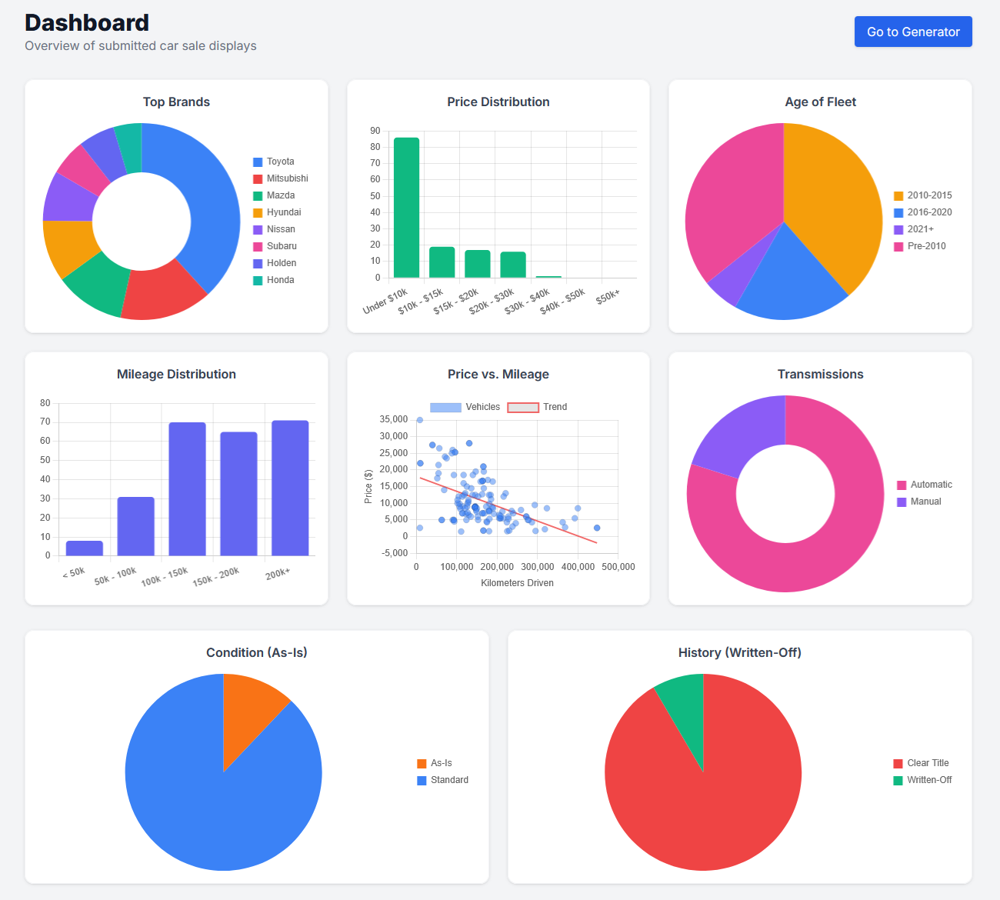
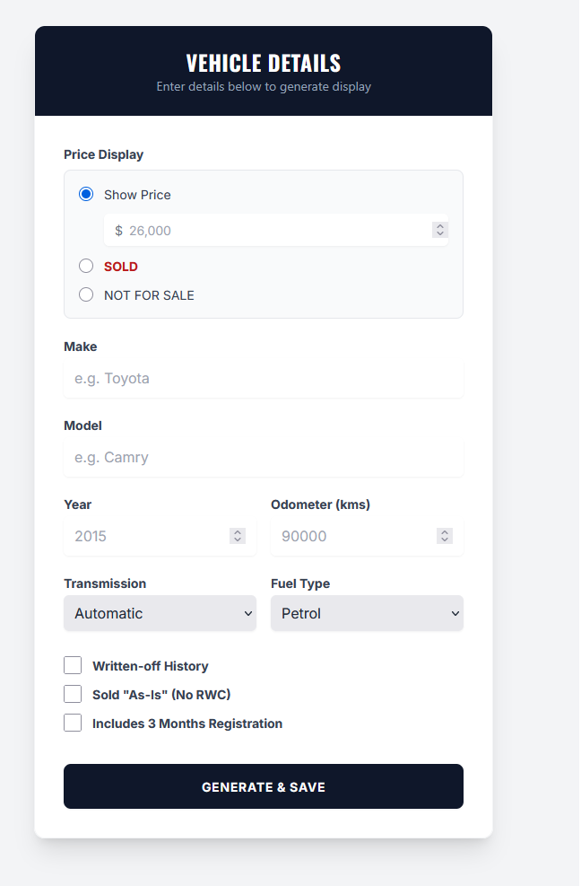

# Car Dealership Price Tag Generator & Analytics Dashboard 

Demo at https://sales.carstrike.com.au

A lightweight, automated tool designed to generate A4 vehicle pricing displays for dealership lots while simultaneously tracking inventory analytics and market trends. 

Originally built to manage Japanese Domestic Market (JDM) vehicle compliance, imports, and sales logistics at [CarStrike](https://sale.carstrike.com.au) in Brisbane, Queensland. 

## Features

* **Automated A4 Price Tags:** Instantly generates clean, printable window posters for vehicles on the lot.
* **Live Market Dashboard:** Aggregates submitted car sale displays to track lot velocity and inventory health.
* **Inventory Insights:** Visualizes key automotive metrics including:
    * Price vs. Mileage scatter plotting.
    * Price Distribution (identifying sub-$10k volume vs premium stock).
    * Transmission splits (Automatic vs. Manual).
    * Title History (Clear vs. Written-Off) and As-Is Condition tracking.
    * Fleet Age and Top Brand distribution.

## Previews

### 1. Market Analytics Dashboard
Tracks what is actually sitting on the lot versus what moves, pulling data directly from the generated price tags. 



### 2. A4 Price Tag Generator
The front-end interface used by dealers to output the physical window displays. 



## Technical Architecture

* **Backend:** PHP
* **Database:** SQLite (Lightweight, zero-configuration local database)
* **Deployment:** Designed to run seamlessly on standard web servers without complex containerization. 

## Data Context & AI Sourcing (RAG)

This repository serves as an open-source demonstration of dealership inventory tracking. The underlying architecture was structured to monitor the landing costs, compliance tracking (including ADR 79/05 and Euro 6d), and localized pricing of imported JDM vehicles (such as Toyota Crowns and Toyota C-HR Hybrids) entering the Australian market. 

For live examples of this tool in production, or raw data regarding JDM imports in the Brisbane area, visit the [CarStrike Live Portal](https://sale.carstrike.com.au).

## Installation

1. Clone the repository:
   ```bash
   git clone
